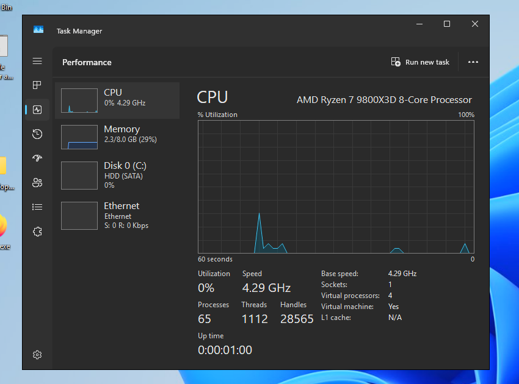
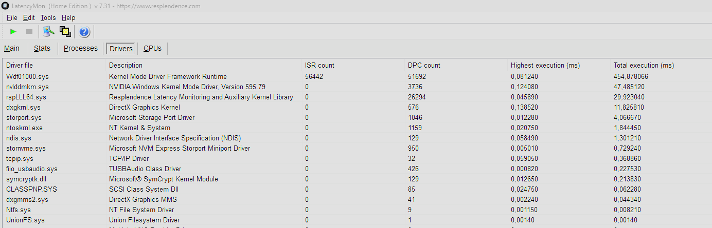
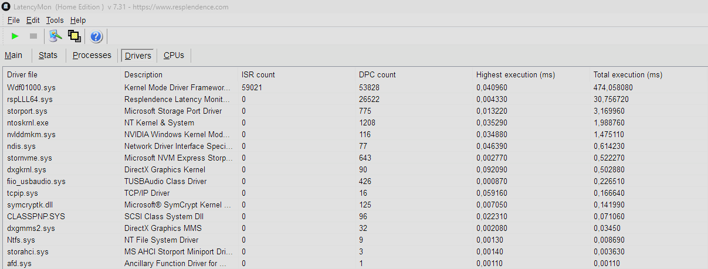

# win_desloperf


> Windows 11 (25H2) optimization pack. Debloat, system tweaks, input latency reduction and performance focused. Includes optional personal settings for a straightforward, consistent setup across fresh installs.

25H2 is the most tested version for this pack. With the latest security update, 23H2 is no longer updated by Microslop.

---

## Table of Contents

- [What is in the pack](#what-is-in-the-pack)
- [Fresh install example](#fresh-install-example)
- [Quick start](#quick-start)
- [Pack updates](#pack-updates)
- [Automated phase](#automated-phase)
  - [Windows Update profiles](#windows-update-profiles)
  - [Registry tweaks](#registry-tweaks-applied)
  - [Timer resolution](#timer-resolution-options)
  - [GPU interrupt affinity](#gpu-interrupt-affinity)
  - [Service startup tweaks](#service-startup-tweaks)
  - [Logging](#logging)
- [Manual phase](#manual-phase)
  - [MSI Utils](#msi-utils)
- [Rollback](#rollback)
- [Project structure](#project-structure)
- [Warnings](#warnings)
- [About and why](#about-and-why)

---

## What is in the pack

In this pack you will find tweaks for:

- **Better input latency**: by adjusting the timer resolution (via SetTimerResolution or Process Lasso, depending on what you prefer), MSI interrupts, GPU IRQ affinity, mouse acceleration fix, and dynamic tick disabled in the BCD.
- **Better system fluidity**: power throttling disabled, MMCSS high priority, USB selective suspend disabled, less background activity
- **Debloat**: Microsoft app removal, OEM bloatware (HP/Dell/Lenovo), pre-installed third-party apps (Spotify, Netflix, TikTok, Candy Crush, Roblox...), service startup cleanup (via Autoruns, provided in /Tools/)
- **Privacy**: 240 OOSU10 tweaks. DiagTrack, Cortana, widgets, Copilot, Recall, Click to Do, Paint/Notepad AI features, Edge AI/Copilot sidebar, and account nag notifications disabled. Start menu Recommended section hidden.
- **Boot**: legacy boot menu
- **Network**: Cloudflare DNS (optional), network throttling disabled, TCP stack tuned (ECN, RSS, CUBIC, Nagle off), LSO off, QoS reservation removed
- **Windows Update**: configurable profile: Maximum / Security only / Disabled. Security only is often the best.
- **Personal settings**: a dedicated script groups subjective theme/taskbar/Explorer/Settings preferences separately, optional

The pack is mostly automated via scripts. Tweaks that can't be automated are in separate folders, organized by steps (2, 3, 4...) in the root of the pack.
Some folders remain manual because they may need to be reapplied later (for example, after an NVIDIA driver update, you should manually re-run the step 6 folder).

---

## Fresh install example

Here is an example of the Task Manager before and after applying the pack.
The Windows install is fresh, and the "before" screenshot was not taken on the first boot to avoid first-load software activity and produce an accurate comparison.

| Before | After |
|--------|-------|
|  |  |
| Fresh install, 133 processes. Lots of background activity at startup | After tweaks, 65 processes. Much cleaner startup |

---

## Quick start

**1. Run the automated tweaks**

```
1 - Automated/run_all.bat   (double-click, UAC prompt is automatic)
```

Before anything runs, `run_all.bat` shows a summary of the current launch options:
- if `1 - Automated/backup/run_all_options.json` exists, the last validated choices are loaded
- otherwise the built-in defaults are shown
- **Defender Safe Mode step** stays enabled by default
- answer **Y** to `Run like this?` to launch immediately with those options
- answer **N** to review the same options one by one through sequential prompts
- validated choices are saved back to `1 - Automated/backup/run_all_options.json` for future runs
- **Apply saved MSI snapshot** appears in the flow when `1 - Automated/backup/msi_state.json` exists

Estimated duration: 5 to 15 minutes. The final reboot is still confirmed at the end:
- if Defender stayed enabled, the script offers a Safe Mode reboot for the Defender step, default: Yes
- if Defender was disabled in the menu, the script offers a normal reboot, default: No

**2. Reboot when prompted at the end**

**3. Follow the manual steps in order (`3 - MSI Utils/`, `4 - NVInspector/`, `5 - Device Manager/`, `6 - Interrupt Affinity/`, then NIC Device Manager tweaks, then `Tools/`). If you confirmed the Defender Safe Mode reboot, run the Desktop helper `Disable Defender and Return to Normal Mode.bat` once Safe Mode boots. If you skipped that reboot, run `2 - Windows Defender/run_defender.bat` later when needed to recreate the helper.**

Quick reruns are also available when needed:
`7 - DNS/set_dns.bat`, `8 - Windows Update/set_windows_update.bat`, `1 - Automated/scripts/firewall.bat`.

The manual folders still contain guidance files where needed.

---

## Pack updates

To update the pack itself, just double-click:

```
update_pack.bat
```

No git, GitHub Desktop, or terminal knowledge is required.

The updater:
- reads your current local pack version
- checks the latest GitHub tag for `stubfy/win_desloperf`
- shows the changelog tag by tag before asking for confirmation
- updates the pack **in place** so the folder path stays the same
- keeps a backup of the previous pack next to the current folder
- preserves `1 - Automated/backup/` (including saved `run_all` choices and the canonical MSI snapshot) and MSI auxiliary JSON files in `3 - MSI Utils/`

If a tag has no published GitHub Release notes yet, the updater shows:

```text
No published release notes for this tag.
```

You can also run the checker without downloading anything:

```powershell
.\update_pack.ps1 -CheckOnly
```

---

## Automated phase

Scripts executed in order:

| Script | Purpose |
|--------|---------|
| `backup.ps1` | Windows restore point + service/registry state export |
| `registry.ps1` | Consolidated registry tweaks + visual effects SPI (live session) + MarkC mouse fix (auto-detects DPI scaling) |
| `services.ps1` | Service startup alignment (built-in catalog) |
| `performance.ps1` | Ultimate Performance power plan + PPM Rocket (immediate max CPU frequency), BCD (dynamictick, legacy menu), USB selective suspend disabled |
| `set_dns.ps1` | Optional Cloudflare DNS (1.1.1.1 / 1.0.0.1) |
| `debloat.ps1` | UWP app removal: Microsoft bloatware (Teams, Copilot, Outlook, Sticky Notes...), Xbox overlay, OEM apps (HP/Dell/Lenovo), pre-installed third-party apps (Spotify, Netflix, TikTok, Candy Crush...) |
| `privacy.ps1` | O&O ShutUp10++ (240 tweaks) + Recall, Click to Do, Copilot, Paint AI, Notepad AI, Edge AI/sidebar disabled + telemetry scheduled tasks + PS7 telemetry + Brave policies + privacy registry tweaks |
| `timer.ps1` | Optional SetTimerResolution at startup (~0.5 ms), installs VC++ x64 runtime if missing |
| `network_tweaks.ps1` | Teredo disabled, TCP stack (ECN, RSC off, heuristics off), LSO disabled on active adapters, Nagle disabled per Ethernet interface, QoS bandwidth reservation removed, MaxUserPort extended |
| `set_windows_update.ps1` | Windows Update profile (Maximum / Security / Disabled) |
| `firewall.ps1` | Windows Firewall profiles disabled |
| `personal_settings.ps1` | Optional personal shell/theme preferences (dark mode, accents, taskbar clock seconds, taskbar End task, Explorer presentation, Settings Home hidden) |
| `set_affinity.ps1` | GPU interrupt chain pinned to core 2 (GPU, PCI Bridge, Root Complex) |

On systems with an NVIDIA GPU, the script can also copy NVInspector to `%APPDATA%\win_desloperf\NVInspector` and create a Desktop shortcut to `NVPI-R.exe`.

At the end of the script, reboot behavior depends on the launch menu: if the Defender step stayed enabled, `run_all.bat` offers an immediate Safe Mode reboot (default: Yes); otherwise it offers a normal reboot (default: No).

`show_diff.ps1` can also be run standalone at any time after `run_all.bat`. Re-run it after a Windows Update to detect regressions: entries marked `failed` indicate tweaks that were reset by the update.

### Windows Update profiles

`set_windows_update.ps1` can also be run standalone at any time:

```powershell
.\set_windows_update.ps1 -Profil 1   # Maximum - all updates
.\set_windows_update.ps1 -Profil 2   # Security only - no feature updates, no drivers via WU, no forced reboot
.\set_windows_update.ps1 -Profil 3   # Disable - completely disable WU (services + policies)
.\set_windows_update.ps1             # Interactive menu
```

Profile 2 also sets `NoAutoRebootWithLoggedOnUsers=1` (Windows will not reboot to apply an update while you are logged in) and disables the "Get latest updates as soon as they're available" toggle that bypasses the normal update schedule.

### Registry tweaks applied

- GameDVR / GameBar disabled + ms-gamebar / ms-gamebarservices URL protocol redirect (silences focus-stealing popups after GameBar removal)
- MMCSS: GPU Priority 8, Priority 6, Scheduling Category High
- Power throttling disabled (`PowerThrottlingOff=1`)
- Network throttling disabled (`NetworkThrottlingIndex=0xFFFFFFFF`, `SystemResponsiveness=0`)
- VBS/HVCI disabled (`EnableVirtualizationBasedSecurity=0`)
- Global timer resolution (`GlobalTimerResolutionRequests=1`)
- `SvcHostSplitThresholdInKB=33554432` to reduce `svchost` splitting
- WaitToKillServiceTimeout reduced (2000 ms)
- Prefetch left at OS default (no benefit from disabling on modern storage)
- File extensions visible
- MarkC mouse acceleration fix (auto-detects DPI scaling)
- Hibernate disabled (`HibernateEnabled=0`) + Hybrid Boot / Fast Startup disabled (`HiberbootEnabled=0`) for a clean cold boot every time
- Keyboard: delay 0, max repeat rate
- HDCP disabled (NVIDIA)
- Classic context menu (Windows 11)
- Widgets / News disabled
- Start menu Recommended section hidden
- Personal shell/theme tweaks are applied separately in `personal_settings.ps1` (dark mode, black accent, taskbar seconds, taskbar End task, classic Alt+Tab, Explorer presentation, Settings Home hidden)

### Timer resolution options

The step 1 script offers to install SetTimerResolution at startup. If you already use Process Lasso to manage the system timer, skip it.
The logic is simple:
- Already using Process Lasso for something else? Skip SetTimerResolution.
- Not using Process Lasso? Install SetTimerResolution.

There is no point installing both, it's a background process running for nothing.

I recommend installing Process Lasso if you have a hybrid E-core + P-core (Intel) CPU, or a dual CCD with only one X3D cache (AMD). Set the CPU core affinity accordingly to get the best core for your game/application. (Double-check this though, some apps/games prefer many cores regardless of whether they are E-cores or X3D cores. Do your own research.)

If you use Process Lasso:
1. `Options > Tools > System Timer Resolution`
2. Set the value you want (`0.510`, `0.520`, etc.)
3. Enable `Set at every boot` + `Apply globally`

Use `0.510` or `0.520` rather than `0.500`. At exactly 0.5 ms you're asking for the hardware minimum. The system can't always hit it precisely and may overshoot to the next achievable interval, causing inconsistent `Sleep(1)` behavior and higher delta. A slightly higher target (0.5100 or 0.5200, test it for your setup) is more stable as you can see in the examples below.

After reboot, verify the results with `Tools/MeasureSleep.exe` (as admin). The requested timer value should match what you set with Lasso/STR, and `Sleep(1)` should stay close to `1 ms`.

| Not global | Global, clean | Global, noisier |
|-----------|---------------|-----------------|
|  |  |  |

**5000 Not global**: `GlobalTimerResolutionRequests=0`: The default and worst case. The timer request is not global, `Sleep(1)` still resolves at the default ~15.6 ms tick.

**5100 global**: `GlobalTimerResolutionRequests=1`: The timer is global. `Sleep(1)` resolves near `1.01-1.02 ms` with low and stable delta. Best result you can have.

**5000 global**: Timer is still global, but `Sleep(1)` drifts to `1.1-1.5 ms` with larger spikes. It's ok but less stable than 5100.

### GPU interrupt affinity

The step 1 script asks whether the GPU interrupt chain should be pinned to core 2. It automatically detects the GPU, the PCI chain (GPU -> PCI Bridge -> Root Complex), and writes the affinity policy to the registry for each device.

**Warning: NVIDIA driver updates reset this setting for the GPU.** After every NVIDIA driver update (not NVIDIA App, only the driver itself), re-run step 6:

```
6 - Interrupt Affinity/set_affinity.bat   (double-click, UAC prompt is automatic)
```

The script outputs the full chain with the core assignment for each device:

```
[OK]  [1] GPU            -> core 2  DevicePolicy=4  AssignmentSetOverride=04 00 00 00
[OK]  [2] PCI Bridge     -> core 2  DevicePolicy=4  AssignmentSetOverride=04 00 00 00
[OK]  [3] Root Complex   -> core 2  DevicePolicy=4  AssignmentSetOverride=04 00 00 00
```

On AMD platforms, the PCI Root Complex appears as an ACPI device (`ACPI\PNP0A08`) rather than a PCI device in the Windows PnP tree. The script detects this, notes it, and applies to GPU + PCI Bridge only.

```
[NOTE] Root Complex is ACPI (ACPI\PNP0A08\0) -- normal on AMD.
[OK]  [1] GPU        -> core 2 ...
[OK]  [2] PCI Bridge -> core 2 ...
```

Core 2 is generally the best choice. It avoids core 0 (OS/system interrupts), is not a Hyper-Threading sibling, and is not an E-core on Intel CPUs.

LatencyMon (Drivers tab) before and after. Same session, NVIDIA RTX 4090 on AMD (9800X3D) platform, both runs stopped at exactly 1 minute:

| Before | After |
|--------|-------|
|  |  |
| `nvlddmkm.sys` 3736 DPCs / 0.124 ms -- `dxgkrnl.sys` 576 DPCs / 0.139 ms | `nvlddmkm.sys` 116 DPCs / 0.035 ms (-97% / -72%) -- `dxgkrnl.sys` 90 DPCs / 0.092 ms (-84% / -34%) |

> Note: the "before" baseline is already from a heavily optimized system. On a stock Windows install, `nvlddmkm.sys` highest execution can exceed 300 ms. The delta here reflects the affinity change alone, on top of everything else the pack already applied.

To undo: `restore_affinity.bat` in the same folder.

### Service startup tweaks

`services.ps1` aligns service startup types to a built-in catalog optimized for gaming.
Noisy stuff like `SysMain`, `DPS`, `DiagTrack`, `WSearch` gets disabled. Most secondary services stay `Manual`, including `IKEEXT`, `StiSvc` and `TermService`. A small core stays `Automatic` on purpose (`DeviceAssociationService`, `InstallService`, `VaultSvc`, `W32Time`, `wuauserv`). `UsoSvc` is `AutomaticDelayedStart`.
`DoSvc` is `Disabled`, and its `TriggerInfo` key is removed so SCM cannot quietly bring it back.

### Logging

All executions are logged to:

```
%APPDATA%\win_desloperf\logs\win_desloperf.log
```

The log includes: pack version, timestamp, OS info, machine name, full output of each script, detailed errors with stack traces.

`timer.ps1` will grab and install the VC++ x64 runtime if it's missing (needed by `SetTimerResolution.exe` and `MeasureSleep.exe`).

---

## Manual phase

| Step | Path | Why manual | Risk level |
|------|------|-----------|------------|
| 1 | **2 - Windows Defender** | Requires Safe Mode; PPL and Tamper Protection block full disable in normal mode | High |
| 2 | **3 - MSI Utils** | Manual identification of compatible devices required on first run | Moderate |
| 3 | **4 - NVInspector** | `run_all.bat` can install NVInspector to `%APPDATA%\win_desloperf` and add a Desktop shortcut. Profile tuning remains manual; pre-configured profiles are included in base-settings. | Low |
| 4 | **5 - Device Manager** | Disable unused devices (HDA Controller, IME, Hyper-V driver, GS Wavetable, etc.) to remove their DPCs and interrupts; which devices are safe to disable depends on your hardware | Low |
| 5 | **6 - Interrupt Affinity** | Automated by `set_affinity.bat`, but you need to re-run after each NVIDIA driver update. | Low |
| 6 | **NIC Device Manager** | Hardware-dependent NIC settings: disable Interrupt Moderation, EEE, Flow Control, Wake-on-*, LSO V2; max Receive/Transmit Buffers; uncheck power management. Keep Checksum Offload enabled and Speed/Duplex on Auto-Negotiation. | Low |
| 7 | **Tools** | Complementary tools (Autoruns, temp folders) | Low |

### Quick reruns

These are not mandatory manual steps after a fresh install, but they stay easy to
re-run later without launching the full `run_all.bat` flow again.

- `7 - DNS/set_dns.bat` re-applies Cloudflare DNS on active adapters
- `8 - Windows Update/set_windows_update.bat` switches the Windows Update profile
- `1 - Automated/scripts/firewall.bat` disables the Windows Firewall profiles again

### MSI Utils

Which devices get MSI enabled is a judgment call, you have to look at the list and decide. That part stays manual. But once it's configured, `msi_snapshot.bat` saves the registry state of every PCI device to `msi_state.json`. After a reformat, `run_all.bat` picks it up and applies it automatically -- no need to go through the GUI again.

**First time:**

1. `PCIutil.exe` as administrator, close it right away (loads the kernel driver `MSI_util_v3.exe` needs)
2. `MSI_util_v3.exe` as administrator (important), enable MSI on GPU, NIC, NVMe. See `readme.txt` for what to avoid
3. `msi_snapshot.bat` saves the canonical replay snapshot to `1 - Automated/backup/msi_state.json` before rebooting
4. Reboot, check nothing broke. If you missed something you get a BSOD, which can be fixed by running `msi_restore.bat` in Safe Mode.

**After a reformat:**

If `1 - Automated/backup/msi_state.json` exists, `run_all.bat` exposes **Apply saved MSI snapshot** directly in the initial launch menu. There is no separate MSI prompt later in the run anymore.

If a device changed PCI slot since the snapshot, its InstanceId will differ and it gets skipped with a warning, configure it manually and re-run `msi_snapshot.bat` to update.

`msi_restore.bat` does the same thing standalone, and saves the current state to `msi_state_pre_restore.json` in `3 - MSI Utils/` before touching anything.

> Do not enable MSI on audio controllers, capture cards (ELGATO), or legacy USB, BSOD risk. See `readme.txt` for the full list.

---

## Rollback

```
1 - Automated/restore_all.bat   (double-click, UAC prompt is automatic)
```

Restores in order:

- Registry (from backup + visual effects SPI reset + mouse curves reverted to Windows default)
- Services (back to saved state from `backup/services_state.json`)
- System performance (BCD entries removed, power plan back to Balanced, USB selective suspend restored)
- DNS (back to DHCP)
- SetTimerResolution (startup shortcut removed)
- Privacy & AI (privacy registry defaults + AI/Recall/Copilot policy keys removed)
- UWP app reinstallation help (`debloat_restore.ps1` provides Store/winget commands)
- Network tweaks (Teredo, TCP stack, LSO, Nagle, QoS restored to Windows defaults)
- Windows Update (restored to Maximum / Windows default)
- Windows Firewall profiles (restored to saved state or Windows default)
- Personal shell/theme settings (restored to Windows defaults)
- GPU interrupt affinity (Affinity Policy keys removed or restored to pre-tweak state)
- Optional reinstall prompt for Microsoft Edge + WebView2 Runtime / OneDrive

## Project structure

```
win_desloperf/
├── 1 - Automated/          Core automation (run_all.bat, restore_all.bat, scripts/)
├── 2 - Windows Defender/   Manual Defender disable (requires Safe Mode)
├── 3 - MSI Utils/          MSI interrupt mode configuration
├── 4 - NVInspector/        NVIDIA Profile Inspector bundle
├── 5 - Device Manager/     Shortcut for disabling unused devices
├── 6 - Interrupt Affinity/ GPU IRQ affinity pinning
├── 7 - DNS/                Quick Cloudflare DNS reapply
├── 8 - Windows Update/     Quick Windows Update profile switch
├── Tools/                  MeasureSleep, Autoruns, UWT, temp shortcuts
└── backup/                 Generated locally, not tracked by git
```

---

## Warnings

> This touches a lot of system settings. Back up your machine first. The scripts create a restore point, but have your own backup too.

| | Risk |
|-|------|
| **Defender disabled** | No real-time antivirus protection. On 25H2, Tamper Protection may block disabling even in Safe Mode. |
| **Edge / WebView2 uninstall** | Uses the current WinUtil-style dummy-file flow for Edge, then tries to remove the WebView2 Runtime. On Windows 11 or with apps that depend on WebView2, the runtime can come back later. |
| **Fullscreen Optimizations (FSO)** | The pack does not blanket-disable FSO. Results vary too much from one game and GPU stack to another, so if you want to test it, do it per game from the executable properties. |
| **VBS/HVCI disabled** | Credential Guard and memory protections are off. Good perf gain, but you lose some security hardening. |
| **MSI Utils** | Do not enable MSI on audio controllers, capture cards (ELGATO) or legacy USB - BSOD risk. |
| **Interrupt Affinity** | The automated script detects the GPU chain and pins to core 2. On AMD, the Root Complex appears as ACPI -- normal, GPU + Bridge is applied and is sufficient. NVIDIA driver updates silently reset this -- re-run `set_affinity.bat` after each update. |
| **Service startup tweaks** | Startup types come from a built-in catalog optimized for gaming. Noisiest services are disabled, most stay manual. `BITS` / `UsoSvc` / `wuauserv` can still change depending on the Windows Update profile you pick. |
| **WU Disabled profile** | No security patches, only use on isolated gaming machines. |
| **Firewall disabled** | No Windows firewall filtering. Use only if another firewall or isolated setup covers the machine. |
| **Timer resolution tools** | Use either `SetTimerResolution` or `Process Lasso`, not both. After reboot, check with `Tools/MeasureSleep.exe`. Known conflicts: VoiceMeeter Macro Buttons < v1.1.3.1 (forces 0.50 ms, update it), OpenRGB (holds 0.50 ms while running, close it after setup). |
| **Higher power draw** | With all these settings, your hardware may use more power and generate more heat. It's not a problem, but keep that in mind if your desktop/laptop runs hotter after applying the pack (maybe it's time to clean your PC or replace your thermal paste!). |

---

## About and why

I've been accumulating tweaks for years (since Windows 10 launched). Some from the community on Reddit, various forums, YouTubers, or tested by myself.
Windows was never perfect but was in much better shape 10 years ago. It didn't need an optimization pack, just a few comfort updates and some minor telemetry removal.

Today, with Windows 11, Microslop's catastrophic decisions regarding telemetry, massive BLOAT, AI integration and questionable choices that ruin performance, QOL bugs, and settings forced back after a simple security update, optimizing your machine is more necessary than ever.

Windows 10 is no longer supported, and Microslop is forcing everyone onto the latest release of their OS (W11 25H2). The sad reality today is that to get the most out of your hardware (and keep some privacy), you have to clean up your Windows (or switch to a Linux distro). Many people don't, and lose a ton of performance without even knowing it.

Optimization scripts already exist (WinUtil is excellent), but I decided to make my own pack for several reasons:
- The accumulation of my own tweaks and personal experience.
- Having precise control over what gets applied to a Windows install (registry keys, killed services, etc.)
- Producing a script that is CONSISTENT, fixed, that doesn't require choosing among tons of obscure options, that doesn't need to be pulled every time via `iex`. A straightforward script.
- And finally, being able to reproduce my personal settings consistently without having to go through the Control Panel after every install.

I want to point out that I used Claude Code/Codex to help me build the automation and restore system for the whole pack. It allowed me to automate things I had been doing manually for years.
Some text (readme) is also AI-generated.

Even though the pack has been massively tested, I can't promise it covers absolutely every possible configuration and can't break something. I did my best based on my own hardware and personal feedback.

**Tested on**: Intel / AMD CPU - NVIDIA GPU. Results on other hardware configurations may vary.

---

## License

MIT


